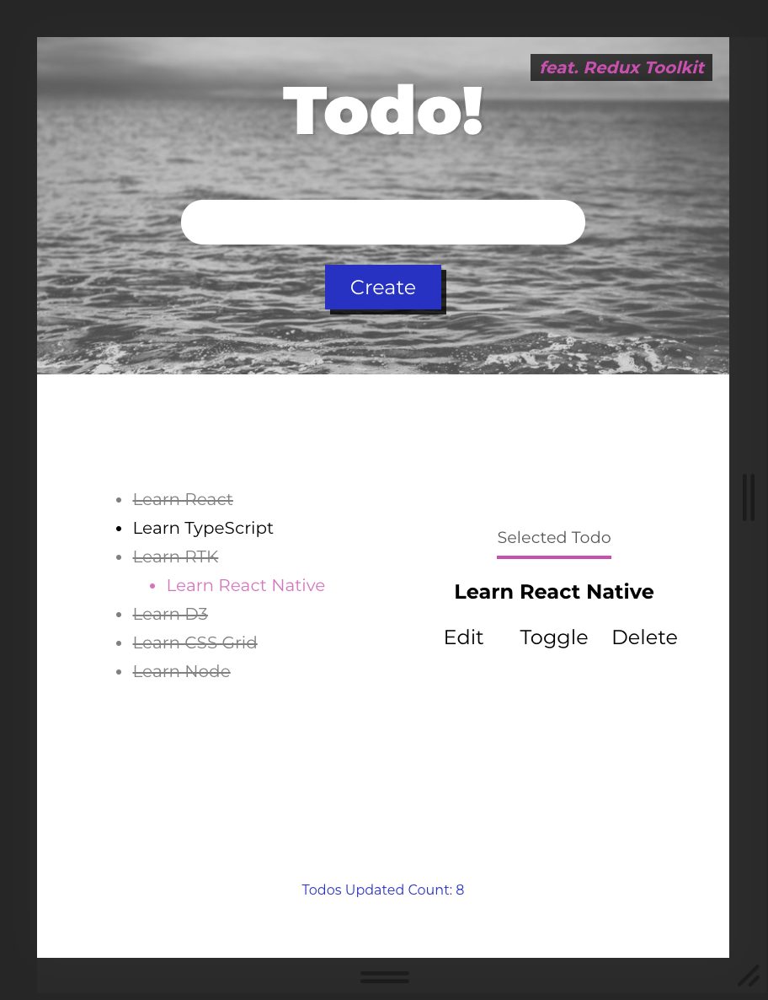

# Todo with Redux Toolkit

A fork from Justin Kim's [Deep Dive into Redux Toolkit with React - Complete Guide](https://www.youtube.com/watch?v=9lCmbth63k0)

#### Screenshots

<table>
<tr>
<td>Mobile 1</td>
<td>Mobile 2</td>
<td>Tablet</td>
</tr>
<tr>
<td></td>
<td></td>
<td></td>
</tr>
</table>

## New

- New design - Responsive layout with CSS grid and animated UI
- Hides footer on scroll-down - with `useScroll` custom hook

## Workflow Redux vs RTK

### Pre-redux

1. Design & markup

- create mock object array to map into a list
- create variables (boolean) to conditionally render components

2. Create local states (input binding & etc...) & refs (focusing)
3. Assign empty handlers to UIs. You can add if checks to return out of the handler where appropriate.

---

### Redux or RTK

#### Redux

1. Create constants

- usually correspond to the handlers you created earlier.
- usually some form of CRUD to pass around the main data objects.
  - Create - CREATE_TODO
  - Read - SELECT_TODO
  - Update - EDIT_TODO, TOGGLE_TODO
  - Delete - DELETE_TODO

2. Write action shapes(interfaces) & action creators for each of the constants

- CreateTodoAction & createTodo

3. Write reducers that update pieces of state they are responsible for.

- first create a Union Type of all the actions (created in 2.) that goes into each reducer.
- assign initial state and actionTypes to the action.

4. Combine reducers with `combineReducers({ someState: someStateReducer})`
5. Create store with `createStore()`, passing in the combined reducer and enhancers & export.

#### Redux Toolkit

1. No constants
2. No action shapes & creators
3. Start with `createSlice` right away

- name
- initialState
- reducers - fn | object { reducer, prepare }
- extraReducers?

4. Map states to reducers inside an object
5. Create store with `configureStore()`, passing in the reducer object (and optional configuration) & export

---

### React Component

1. Import action creators from the ducks file.
2. Use `useSelector` hook to replace mock objects and variables created at the beginning.
3. Use `useDispatch` to get dispatch connected to the store.
4. Dispatch actions returned from action creators inside handlers.

- add type guards for the arguments required by action creators
- set local state where appropriate (clear form, spinners, etc...)

## RTK vs Redux

|                        | Redux Toolkit                                          | Redux                                                       |
| ---------------------- | ------------------------------------------------------ | ----------------------------------------------------------- |
| Action handling        | `createSlice`                                          | constants + creators + reducers                             |
| Action creators        | available at `Slice.actions`                           | write manually                                              |
| TS types for Action    | use `PayloadAction`                                    | use manually written interface + unionize them for reducers |
| Side effects           | inside `prepare` callback to customize payload         | inside action creators                                      |
| Async requests         | inside `createAsyncThunk` payload creator callback     | inside thunk action dispatchers                             |
| Action creator exports | destructure from Slice.actions and map to easier names | export hand-written action creators individually            |
| Combining reducers     | an object with key(state) - value(reducer) pair        | `combineReducers` and pass the mapped object                |
| Creating store         | `configureStore`                                       | `createStore`                                               |
| Dev tool               | included                                               | compose with enhancers                                      |
| Middlewares            | `getDefaultMiddleware()` included by default           | have to explicitly include                                  |

## Prepare callback

By default, the action creators generated by RTK **accept a single argument** which is stored at `action.payload`.

Use prepare callback when you need to:

- Write additional logic to customize payload value
- Accept multiple parameters from the action creator
- Create side-effects : randomID, new Date(), etc...

If provided, all arguments from the action creator will be passed to the prepare callback.

### Prepare callback return

Prepare callback returns an object with the following fields.

#### type

The `type` field is added automatically.

#### payload

Prepare function must return an object with the `payload` field, otherwise, the payload of the created actions becomes undefined.

#### meta?

`meta` field may contain extra information about the action.

```ts
const blogSlice = createSlice({
  name: 'blogData',
  initialState,
  reducers: {
    receivedAll: {
      reducer(
        state,
        action: PayloadAction<Page[], string, { currentPage: number }>
      ) {
        state.all = action.payload;
        state.meta = action.meta;
      },
      prepare(payload: Page[], currentPage: number) {
        return { payload, meta: { currentPage } };
      },
    },
  },
});
```

#### error?

`error` may contain details about the action failure.

```ts
interface RejectedWithValueAction<ThunkArg, RejectedValue> {
  type: string;
  payload: RejectedValue;
  error: { message: 'Rejected' };
  meta: {
    requestId: string;
    arg: ThunkArg;
    aborted: boolean;
  };
}
```

## Async Requests with `createAsyncThunk`

You can perform asynchronous requests inside the `payload creator callback` passed as 2nd argument to the `createAsyncThunk` API.

`createAsyncThunk` returns a **thunk action creator** that accepts a single argument which will be passed as the 1st argument to the payload creator callback.

The payload creator also receives a `thunkAPI` object as 2nd argument. It contains the parameters that are normally passed to a standard Redux Thunk function + more.

```ts
interface ThunkAPI {
  dispatch: Function;
  getState: Function;
  extra?: any;
  requestId: string; // auto-generated unique random request ID
  signal: AbortSignal; // AbortController.signal object
}
```

```ts
/* 0. Dispatched somewhere in the app */
dispatch(fetchUserById(123)); // this makes an async request

/* 1. create the thunk */
const fetchUserById = createAsyncThunk(
  // action type prefix
  'users/fetchByIdStatus',
  // payload creator: userId = 123
  async (userId, thunkAPI) => {
    const response = await userAPI.fetchById(userId);
    return response.data; // returns a Promise
  }
);

/*  2. Handle actions in your reducers */
const usersSlice = createSlice({
  name: 'users',
  initialState: { entities: [], loading: 'idle' },
  reducers: {
    // standard reducer logic, with auto-generated action types per reducer
  },
  extraReducers: {
    // Add reducers for additional action types (thunk) here,
    // and handle loading state as needed
    [fetchUserById.fulfilled]: (state, action) => {
      // Add user to the state array
      state.entities.push(action.payload);
    },
  },
});
```

### More on [createAsyncThunk](https://redux-toolkit.js.org/api/createAsyncThunk#createasyncthunk)
