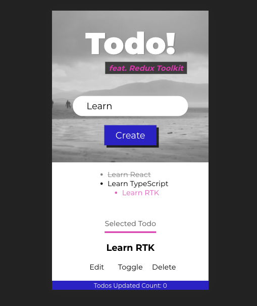
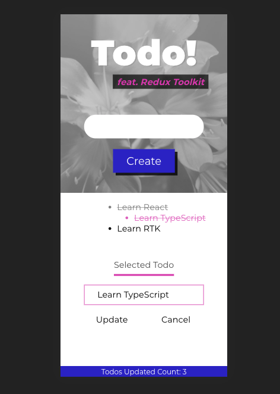

# Todo with Redux Toolkit

A fork from Justin Kim's [Deep Dive into Redux Toolkit with React - Complete Guide](https://www.youtube.com/watch?v=9lCmbth63k0)

## New

- New design - Responsive layout with CSS grid and animated UI

## Traditional React-Redux Workflow

### Pre-redux

1. Design & markup

- create mock object array to map into a list
- create switch variables to conditionally render components

2. Create local states (input binding & etc...) & refs (focusing)
3. Assign empty handlers to UIs. You can add if checks to return out of the handler where appropriate.

### Redux

1. Create constants

- usually correspond to the handlers you created earlier.
- usually some form of CRUD to pass around the main data objects.
  - Create - CREATE_TODO
  - Read - SELECT_TODO
  - Update - EDIT_TODO, TOGGLE_TODO
  - Delete - DELETE_TODO

2. Write action shapes(interfaces) & action creators for each of the constants

- CreateTodoAction & createTodo

3. Write reducers that update pieces of state they are responsible for.

- first create a Union Type of all the actions (created in 2.) that goes into each reducer.
- assign initial state and actionTypes to the action.

4. Combine reducers with `combineReducers({ someState: someStateReducer})`
5. Create store with `createStore()`, passing in the combined reducer and enhancers & export.

### React Component

1. Import action creators from the ducks file.
2. Use `useSelector` hook to replace mock objects and variables created at the beginning.
3. Use `useDispatch` to get dispatch connected to the store.
4. Dispatch actions returned from action creators inside handlers.

- add type guards for the arguments required by action creators
- set local state where appropriate (clear form, spinners, etc...)

## Redux Toolkit
